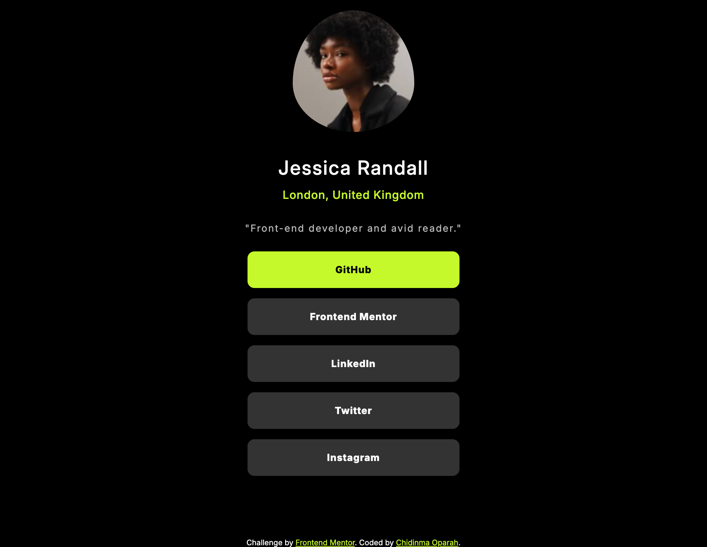

# Frontend Mentor - Social links profile solution

This is a solution to the [Social links profile challenge on Frontend Mentor](https://www.frontendmentor.io/challenges/social-links-profile-UG32l9m6dQ). Frontend Mentor challenges help you improve your coding skills by building realistic projects. 

## Table of contents

- [Overview](#overview)
  - [The challenge](#the-challenge)
  - [Screenshot](#screenshot)
  - [Links](#links)
- [My process](#my-process)
  - [Built with](#built-with)
  - [What I learned](#what-i-learned)
  - [Continued development](#continued-development)
  - [Useful resources](#useful-resources)
- [Author](#author)
- [Acknowledgments](#acknowledgments)

## Overview

### Screenshot



### Links


- Live Site URL: [Add live site URL here](https://your-live-site-url.com)

## My process

### Built with

- Semantic HTML5 markup
- CSS custom properties
- Flexbox
- Mobile-first workflow


### What I learned

- More practice on responsive design using css media query.

To see how you can add code snippets, see below:


```css
@media only screen and (max-width: 500px) {
    .container {
        width: 100%;
        margin: 0 ;
    }
    .links{
        width: 80%;
    }
}

@media (min-width: 768px) and (max-width: 1000px) {
    .container {
        width: 100%;
        margin: 0 auto;
    }
    .links{
        width: 40%;
    }
}

@media (min-width: 1001px) and (max-width: 1024px) {
    .container {
        width: 100%;
        margin: 0 auto;
    }
    .links{
        width: 30%;
    }
}

@media (width: 1440px) {
    .container {
        width: 76%;
        margin: 0 auto;
    }
    .links{
        width: 30%;
    }
}
```


### Continued development

- Media query
- CSS Flexbox
- Code refactoring

### Useful resources

- w3schools
- Chat GPT

## Author

- Website - Chidinma Oparah
- Frontend Mentor - @Nma01


## Acknowledgments

- Kudos to my husband (Tunde Phillips) for believing in me and encouraging me to start learning to code again after several failed attempts at it.
